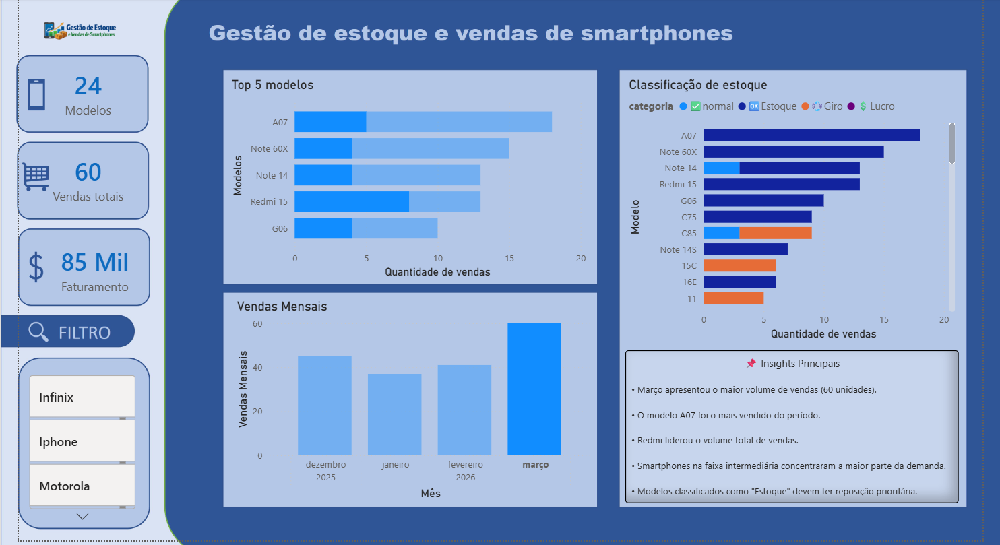

# 📊 Gestão de Estoque e Vendas de Smartphones

Sobre o Projet

Este projeto foi desenvolvido com o objetivo de analisar vendas de smartphones e identificar padrões que auxiliem decisões de estoque.

A análise foi realizada utilizando Python para tratamento dos dados e Power BI para construção do dashboard interativo.

## 🎯 Objetivo:

Responder perguntas de negócio como:

- Qual o faturamento total?
- Qual mês apresentou mais vendas?
- Quais modelos possuem maior giro?
- Quais marcas lideram as vendas?
- Quais produtos devem ter prioridade no estoque?

## Tecnologias utilizadas

## 📈 Principais Insights

- Março apresentou o maior volume de vendas.
- O modelo A07 foi o mais vendido do período.
- Redmi liderou o volume de aparelhos vendidos.
- Smartphones intermediários concentraram grande parte das vendas.
- Modelos classificados como "Estoque" devem ter reposição prioritária.

## 📊 Dashboard

Abaixo temos um dashboard simples e poderoso. Nele, podemos consultar a quantidade de vendas, produtos e faturamento de cada mês, além de analisar os dados por modelo e marca.

Também contamos com um gráfico que apresenta quais modelos permanecem em estoque e quais podem ser utilizados para aumentar o giro e a rentabilidade do negócio. Com essas informações, é possível identificar quais produtos devem ser priorizados e mantidos sempre disponíveis em estoque.

## Conclusão

A análise permitiu identificar padrões de vendas, modelos com maior potencial de giro e oportunidades de otimização do estoque. Os resultados podem auxiliar decisões estratégicas de compra e reposição, contribuindo para uma gestão mais eficiente.